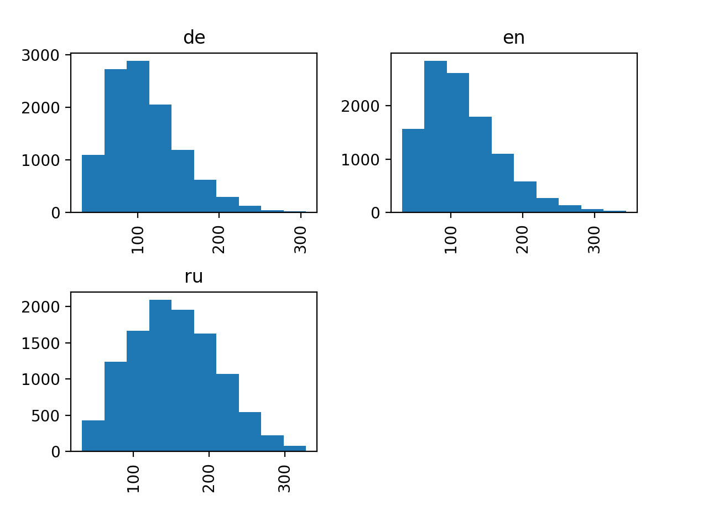

# Voice Language Identification 

## DEMO
```commandline
brew install portaudio # для работы микрофона
python3 -m venv env
source env/bin/activate
python3 -m pip install -r requirements.txt
```
Далее запустите "notebooks/Live DEMO.ipynb"


## Задача
1. Решить задачу определения языка в речевом канале на три языка: русский, английский, немецкий. При обучении и инференсе необходимо использовать информацию только из аудио.


## Данные
Данные были собраны из открытого источника Common Voice [Link](https://commonvoice.mozilla.org/ru/datasets).

|         | ru  | en  | de  |
| ------- | --- | --- | --- |
| version | v6  | v1  | v1  |
| GB      | 3   | 21  | 4   |
| format  | mp3 | mp3 | mp3 |
| hours   | 111 | 582 | 140 |

Заметки:
- В данных довольно часто попадают зашумленые аудио сэмплы, особенно в немецком датасете.
- Часто бывает что речь может начаться спустя 2-3 секунды в записях.
- Попадаются записи без речи даже в провалидированных выборках.
- Имеются мужские и женский голоса разных возрастов. 

### Preprocessing
1. Подавление шума в записях.
1. Передискретизация звука до 16000.
1. Отрезаем с двух сторон тишину в каждом аудиофайле при помощи Voice Activity Detection.
1. Resampling reduce dimensionality.
1. Silence removal VAD Voice Activity Detection.

```commandline
make preprocess_ru
make preprocess_en
make preprocess_de
```

### Data augmentation
Простая форма увеличения кол-ва данных выполнена путем небольшого их
изменения

- Pitch-shift (тональность голоса) [0.93, 1.07, 0.81, 1.23]
- Time-stretch (скорость речи) [-1, 1, 2, -2, 2.5, -2.5, 3.5, -3.5]

Коэффициенты выставлены по приоритету и регулируются через ключ 'augmentations'.

### Featurization


1. Short-Time Fourier Transform (n_fft=1024, hop_length=512)
1. Mel-Filter Cepstral Coefficients (n_mels=32)
1. Normalization (max [0,1] или meanstd[-1,1])

```commandline
make featurize_ru
make featurize_en
make featurize_de
```



## Run experiments
Для обучения нужной модели на нужных данных нужно заполнить новый
*конфигурационный файл* в папке experiments.
Далее в Makefile выбрать ее и запустить команду ниже.
```commandline
make train
```
    
## Model
Основная идея инструмента для распознавания языка, заключается в то что мы берем
фрагменты по секунде и обучаем классификатор на таких фрагментвх.
Далее на первых 10 секундах записи проходим окном имеющие пересечения между собой.
Все оконные предсказания аггрегируются и получаем одно предсказание на весь аудиоряд.

### Voting prediction
Общий прогноз - это класс, который чаще всего встречается в отдельных прогнозах (voting=majority).
При вероятностном голосовании вероятности отдельных прогнозов
усредняются вместе, и прогноз на выходе представляет собой класс с самой высокой общей
вероятностью (voting=mean).

### DCNN
"Dilated Convolution Neural Network with LeakyReLU for Environmental Sound Classification"
[Link](https://ieeexplore.ieee.org/document/8096153)

В данной статье обосновали выбор большого ядра свертки для mel-coefficients а именно 5x5.

### LD-CNN
"LD-CNN: A Lightweight Dilated Convolutional Neural Network for Environmental Sound Classification"
[Link](http://epubs.surrey.ac.uk/849351/1/LD-CNN.pdf)


### SB-CNN
"Dilated Convolution Neural Network with LeakyReLU for Environmental Sound Classification"
[Link](https://ieeexplore.ieee.org/document/8096153)
 
### Recurrent
Это простая модель предсталяющая собой двухслойный набор LSTM слоев где sequence это фреймы 
то есть 32 mel коэффициентов в какой-то момент времени. Далее Many-to-one
 
### Common-CNN
После многих опытов с предыдущими моделями, пришел к подобной архтектуре, из набора
Conv2D и AveragePooling2D выставленных в особенном порядке и особенных конфигурациях
свертки и stide. 

### DenseNet
"Densenet"
[Link](https://github.com/keras-team/keras-contrib/blob/master/keras_contrib/applications/densenet.py)

DenseNet - это простая сетевая архитектура которая представляет из себя
полносвзяанные сети прямого распространения.


## Future works
1. Использовать StarSpace архитектуру [Link](https://arxiv.org/abs/1709.03856)
вместо полносвязанного слоя в DCNN.
2. Make the STFT-mel filter trainable, with L1 regularization that
(a) reduces from top (high frequency),
(b) reduces from bottom (low frequency).

1. Сделайте фильтр STFT-mel обучаемым, с регуляризацией L1, которая
(а) уменьшает влияние верхних частот (low-pass filter коэффициент),
(б) уменьшает влияние нижних частот (high-pass filter коэффициент).
